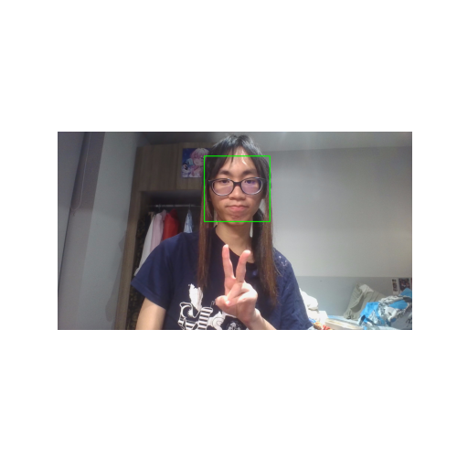
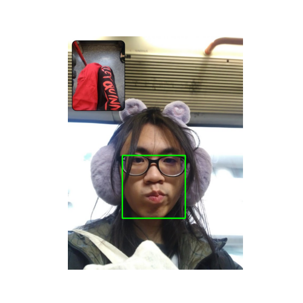
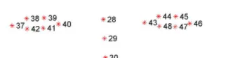

> for abridged documentation please see the [README](README.md)

# Concept and Plan

Live facial tracking applied to a model rig - including features like head movements, eyes and speech. Perhaps also an emotion recognition program to change expressions.

Checklist:
- [x] Static Image Facial Detection 
- [x] Live Face Detection through Webcam  
- [x] Precise Facial Feature Tracking - Landmark Detection with Dlib
- [ ] Identify and Parameterize Specific Facial Features
	- [x] Eyes - Open / Close
	- [ ] Head Movement - Left / Right (X), Up / Down (Y), Rotation
	- [ ] Eyebrows - Raise / Normal
	- [ ] Mouth (Jaw) - Open / Close
	- [ ] Lips - Smile / Frown
- [ ] Connect Tracking to a Model (2D)
	- [ ] **Design a simple model** that can move individual parts (or use a template model available for free)
	- [ ] Create a **Unity build that communicates** with the Python files for Parameter Control - likely OSC socket connection
	- [ ] **Normalize and parse input values** from Tracking Data to Model Parameters (i.e. JSON file of all parameter values to send)
	- [ ] Unity build should link to model - allowing for initial calibration, movement and facial features
- [ ] Implement to a streaming software to capture model (OBS)

# Static Face Detection
> Found in [opencv_static.py](opencv_static.py)
## OpenCV
https://www.datacamp.com/tutorial/face-detection-python-opencv

OpenCV is a popular computer vision library - and supports Python, which we will be using.
- Contains >2500 algorithms allowing users to perform tasks like face recognition and object detection
- For face detection - OpenCV has models that have already been trained and so I don't need to train an algorithm from scratch.
## Haar Cascade
https://www.researchgate.net/publication/3940582_Rapid_Object_Detection_using_a_Boosted_Cascade_of_Simple_Features

https://machinelearningmastery.com/using-haar-cascade-for-object-detection/

> The idea behind this technique involves using a cascade of classifiers to detect different features in an image. These classifiers are then combined into one strong classifier that can accurately distinguish between samples that contain a human face from those that don’t.
## Python Code

**Display Image in Window**
```
cv2.imshow("Disp Window", img)
k = cv2.waitKey(0)
```
waitKey closes the picture when a keyboard key is pressed

**Report Image Dimensions**
`img.shape`
Array is 3D - (Height, Width, Channels)
For coloured images the colour channel is BGR (opposite of RGB)

**Greyscale Conversion**
`cv2.cvtColor(imagename, cv2.COLOR_BGR2GRAY)

**Load Classifier**
```
face_classifier = cv.CascadeClassifier(
    cv.data.haarcascades + "haarcascade_frontalface_default.xml"
)
```

The "haarcascade_frontalface_default.xml" classifier detects frontal faces in visual input
https://github.com/opencv/opencv/tree/master/data/haarcascades - other classifiers

**Face Detection**
```
face = face_classifier.detectMultiScale(
    g_img, scaleFactor=1.1, minNeighbors=5, minSize=(40, 40)
)
```

- detectMultiScale() - identify faces of different sizes in input image
- scaleFactor - scale down input image for algorithm to easier detect large faces
	- 1.1 reduces by img size by 10%
- minNeighbors - specifies number of neighbouring rectangles needed to be identified for object to be valid detection
	- small values (like 1) will result in many false positives, large values will lose out on true positives.
- minSize - minimum size of object to be detected, any faces smaller than that will not be detected

**Bounding Box**
```
for (x, y, w, h) in face:
    cv.rectangle(img, (x, y), (x + w, y + h), (0, 255, 0), 4)
```

**Convert back to RGB and Show**
```
img_rgb = cv.cvtColor(img, cv.COLOR_BGR2RGB)

plt.figure(figsize=(5,5))
plt.imshow(img_rgb)
plt.axis('off')
plt.show()
```

 
# Video Capture and Recognition

> Found in opencv_live.py

Documentation on `cv.VideoCapture()`:
https://docs.opencv.org/3.4/d8/dfe/classcv_1_1VideoCapture.html

```
video_cap = cv.VideoCapture(0) # accesses camera
```

1. Create Bounding Box Part as a Function
	-  `def det_bounding_box(vid): (...)`
2. Run the function and showing each frame in a while True loop
```
while True:
    result, video_frame = video_cap.read() # read video frames
    if not result:
        print("No Camera Detected")
        break

    faces = det_bounding_box(video_frame)

    cv.imshow(
        "Face Detection - Live Video Test", video_frame
    )

    if cv.waitKey(1) & 0xFF == ord("q"): # press "q" to exit
        break
```


# Facial Landmark Extraction

Using Dlib 68-points to detect parts of the face 

Tutorials Referenced:
- https://www.studytonight.com/post/dlib-68-points-face-landmark-detection-with-opencv-and-python
- https://medium.com/analytics-vidhya/facial-landmark-detection-in-real-time-using-opencv-dlib-adbba9255329


# Parameterizing Facial Features

## The Eyes
EAR (Eye Aspect Ratio) is used to determine if an eye is open or closed based on a threshold
https://medium.com/analytics-vidhya/eye-aspect-ratio-ear-and-drowsiness-detector-using-dlib-a0b2c292d706


$$ear = \frac{(A + B)}{(2.0 * C)}$$
- $A$ is horiz distance between p2 and p6
- $B$ is horiz distance between p3 and p5
- $C$ is horizontal distance between p1 and p4

```
# Draw red points over the existing dots if left eye closed
if left_EAR < MIN_EAR:
            draw_shape_points_range(fshape,video_frame,LEFT_EYE_POINTS,(0,0,255))
            cv.putText(video_frame, "Left Eye Closed!", (10, 30),   cv.FONT_HERSHEY_SIMPLEX, 0.7, (0, 0, 255), 2)
```


# Connecting Tracking to a Model

## Designing a Model
Models can be drawn and built from scratch using a software called Live2D.

(tutorials)

However due to the a steep learning curve and irrelevant scope to the module, it was decided that I will not be making a model from scratch.

Free Live2D templates can be found (here), and I will use (this)

An important document to gather from Live2D are their Standard Parameter List:
https://docs.live2d.com/en/cubism-editor-manual/standard-parameter-list/

## Unity Build 


# Implement to OBS
